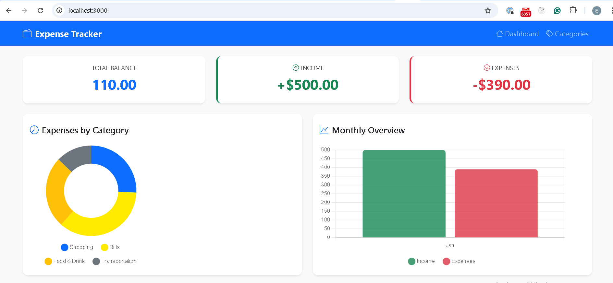
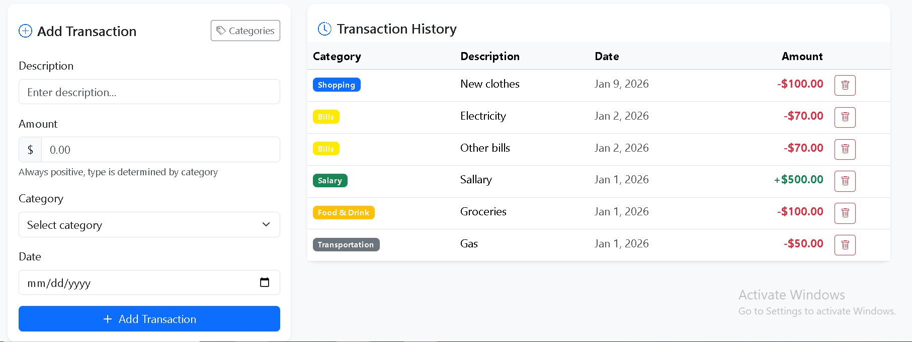

In this post I will walk zou through building a modern expenses tracking application using Express.js, Prisma ORM, MySQL, Handlebars templates and Typescript. This project demonstrates one learning full stack project.

Layered architecture is being used:

- **Routes** -> Define Routes
- **Controllers** -> Handle HTTP request/response
- **Services** -> Contain business logic and database operations

## Database design with Prisma

The schema defines two related models

```prisma
model Category {
  id          Int          @id @default(autoincrement())
  name        String        @unique
  icon        String        @default("")
  color       String        @default("secondary")
  type        String        @default("expense")
  transactions  Transaction[]
  createdAt   DateTime    @default(now())
}

model Transaction {
  id          Int          @id @default(autoincrement())
  description String
  amount      Decimal       @db.Decimal(10, 2)
  type        String
  date        DateTime      @default(now())
  categoryId  Int
  category    Category     @relation(fields: [categoryId], references: [id])
  createdAt   DateTime  @default(now())
  updatedAt   DateTime  @updatedAt
}
```
This translates to 

```mysql
CREATE TABLE `Category` (
    `id` INTEGER NOT NULL AUTO_INCREMENT,
    `name` VARCHAR(191) NOT NULL,
    `icon` VARCHAR(191) NOT NULL DEFAULT '',
    `color` VARCHAR(191) NOT NULL DEFAULT 'secondary',
    `type` VARCHAR(191) NOT NULL DEFAULT 'expense',
    `createdAt` DATETIME(3) NOT NULL DEFAULT CURRENT_TIMESTAMP(3),

    UNIQUE INDEX `Category_name_key`(`name`),
    PRIMARY KEY (`id`)
) DEFAULT CHARACTER SET utf8mb4 COLLATE utf8mb4_unicode_ci;

CREATE TABLE `Transaction` (
    `id` INTEGER NOT NULL AUTO_INCREMENT,
    `description` VARCHAR(191) NOT NULL,
    `amount` DECIMAL(10, 2) NOT NULL,
    `type` VARCHAR(191) NOT NULL,
    `date` DATETIME(3) NOT NULL DEFAULT CURRENT_TIMESTAMP(3),
    `categoryId` INTEGER NOT NULL,
    `createdAt` DATETIME(3) NOT NULL DEFAULT CURRENT_TIMESTAMP(3),
    `updatedAt` DATETIME(3) NOT NULL,

    PRIMARY KEY (`id`)
) DEFAULT CHARACTER SET utf8mb4 COLLATE utf8mb4_unicode_ci;

ALTER TABLE `Transaction` ADD CONSTRAINT `Transaction_categoryId_fkey` FOREIGN KEY (`categoryId`) REFERENCES `Category`(`id`) ON DELETE RESTRICT ON UPDATE CASCADE;
```
The one-to-many relationship between Category and Transaction allows us to:
- Automatically determine transaction type from category
- Group expenses by category for charts
- Use custom colors and icons per category



